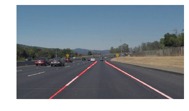

# **Finding Lane Lines on the Road** 

### Reflection

### 1. Describe your pipeline. As part of the description, explain how you modified the draw_lines() function.

My pipeline consisted of 5 steps. 

1. Read in and grayscale the image
2. Apply Gaussian smoothing
3. Canny Edge Detection
    - For Canny Edge Dectction, I set a ration of 1:3 as John Canny himself recommended a low to high ratio of 1:2 or 1:3.
4. Create a masked edges image
    - For creating a masked edges image, I create a mask that only contained the edges of the left line and right line.
5. Finding lines using Hough Transform 
    - For Finding lines using Hough Transform, I used (1, numpy.pi/180, 15, 50, 30) as (rho, theta, threshold, min_line_length, max_line_gap). It is important to set the params to get lines not too long and not to short, so I set a list proper params, which decided it is a line if there are more than 15 points in the grid of (1, numpy.pi/180) and the line is bigger than 50. The gap of two lines must be larger than 30, else it will shows in one line.

In order to draw a single line on the left and right lanes, I modified the draw_lines() function.

1. With different slops, I seprate the slops to two parts, left and right.
2. As the same time, I found some slops were too bigger or two small, than I choose the slops between (0.5)-(2) or (-2)-(-0.5) that made it worked well.
3. Getting the values of average slops of left and right, by the weighting average of the list of slops. If the slop of a longer line it got more weights.
4. Setting average values of left and right points and using it to get the values of x1,y1,x2,y2
5. draw lines by x1,y1,x2,y2

Here is the result: 

### 2. Identify potential shortcomings with your current pipeline

First I fixed the params, for the edges I set the values based on the shape of image 960x540, if the sizes are changed, it will not works well. It would be better if setting the params by percentages. And for Canny Edge Detection and Hough Transform, it also gets the same problems, I think it only works on a small set of images, it is necessray to find a way to set more proper params.

### 3. Suggest possible improvements to your pipeline

A possible improvement would be to use pertentage params for creating a mask. And find a better transform to detect edges of lanes. And about the slops I think choose the slop of max long line segment as the main slops will also works, it worths to try. 