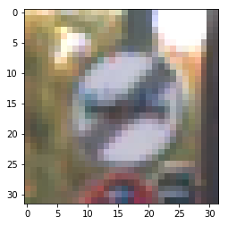
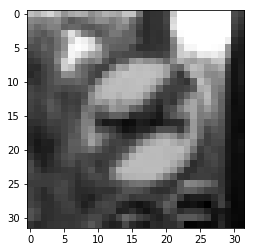
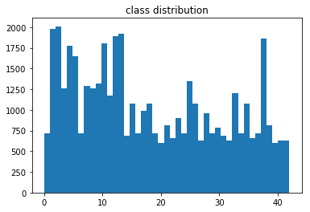
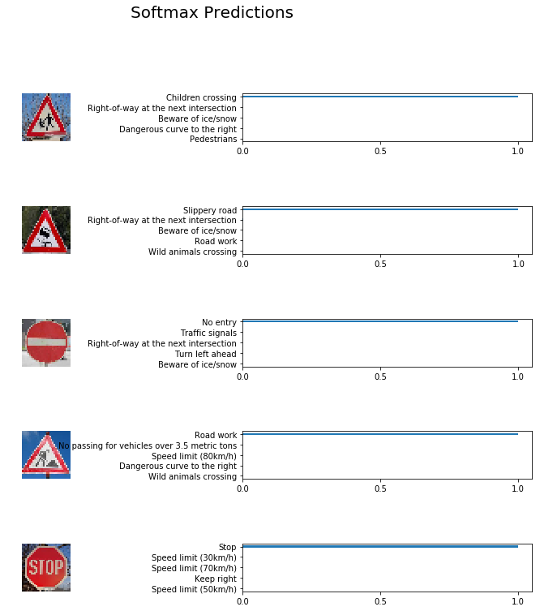

# **Traffic Sign Recognition** 

## Writeup

---

**Build a Traffic Sign Recognition Project**

The goals / steps of this project are the following:
* Load the data set (see below for links to the project data set)
* Explore, summarize and visualize the data set
* Design, train and test a model architecture
* Use the model to make predictions on new images
* Analyze the softmax probabilities of the new images
* Summarize the results with a written report

[//]: # (Image References)

[image1]: ./pic/distribution.png "Visualization"
[image2]: ./examples/grayscale.jpg "Grayscaling"
[image3]: ./examples/random_noise.jpg "Random Noise"
[image4]: ./pic/Children_crossing.jpg "Traffic Sign 1"
[image5]: ./pic/No_entry.jpg "Traffic Sign 2"
[image6]: ./pic/Roadworks.jpg "Traffic Sign 3"
[image7]: ./pic/Slippery_road.jpg "Traffic Sign 4"
[image8]: ./pic/Stop.jpg "Traffic Sign 5"
[origin_pic]: ./pic/origin.png "Origin Pic"
[fake_pic]: ./pic/fake.png "Fake Pic"

## Rubric Points
### Here I will consider the [rubric points](https://review.udacity.com/#!/rubrics/481/view) individually and describe how I addressed each point in my implementation.  

---
### Writeup / README

#### 1. Provide a Writeup / README that includes all the rubric points and how you addressed each one. You can submit your writeup as markdown or pdf. You can use this template as a guide for writing the report. The submission includes the project code.

### Data Set Summary & Exploration

#### 1. Provide a basic summary of the data set. In the code, the analysis should be done using python, numpy and/or pandas methods rather than hardcoding results manually.

I used the pandas library to calculate summary statistics of the traffic
signs data set:

* The size of training set is 34799
* The size of the validation set is 4410
* The size of test set is 12630
* The shape of a traffic sign image is 32x32x3
* The number of unique classes/labels in the data set is 43

#### 2. Include an exploratory visualization of the dataset.

Here is an exploratory visualization of the data set. It is a bar chart showing how the data ...

![alt text][image1]

### Design and Test a Model Architecture

#### 1. Describe how you preprocessed the image data. What techniques were chosen and why did you choose these techniques? Consider including images showing the output of each preprocessing technique. Pre-processing refers to techniques such as converting to grayscale, normalization, etc. (OPTIONAL: As described in the "Stand Out Suggestions" part of the rubric, if you generated additional data for training, describe why you decided to generate additional data, how you generated the data, and provide example images of the additional data. Then describe the characteristics of the augmented training set like number of images in the set, number of images for each class, etc.)

As a first step, I decided to convert the images to grayscale according to [Traffic Sign Recognition with Multi-Scale Convolutional Networks](http://yann.lecun.com/exdb/publis/pdf/sermanet-ijcnn-11.pdf) if we uses grayscale only could have clearly
benefited from color information.

Here is an example of a traffic sign image before and after grayscaling.

 

As a last step, I normalized the image data because if the scales for different features are wildly different, this can have a bad effect on your ability to learn. Ensuring standardised feature values implicitly weights all features equally in their representation.

I decided to generate additional data because there were little images in some classes, it would not make a good training on these classes, we have to make more datas on them. 

To add more data to the the data set, I used the following techniques to random rotate the origin images and random to make it a little blur because it makes the images a little change from human vision side, but it makes a total different bytes data on image pixels that will more efficient to train the model.  

Here is an example of an original image and an augmented image:

![alt text][origin_pic] ![alt text][fake_pic]

The difference between the original data set and the augmented data set is the following the new fake image is random rotate and random blur. 

Now the new distribution is following:

There were 500+ images on every class.

#### 2. Describe what your final model architecture looks like including model type, layers, layer sizes, connectivity, etc.) Consider including a diagram and/or table describing the final model.

My final model consisted of the following layers:

| Layer         		|     Description	        					| 
|:---------------------:|:---------------------------------------------:| 
| Input         		| 32x32x1 Gray image   							| 
| Convolution 3x3     	| 1x1 stride, valid padding, outputs 28x28x64 	|
| RELU					|												|
| Max pooling	      	| 2x2 stride,  outputs 14x14x6  				|
| Convolution 3x3	    | 1x1 stride, valid padding, outputs 10x10x16 	|
| RELU					|												|
| Max pooling	      	| 2x2 stride,  outputs 5x5x16   				|
| Flatten	            | outputs 400  									|
| Fully connected		| outputs 120									|
| RELU					|												|
| Fully connected		| outputs 84									|
| RELU					|												|
| Fully connected		| outputs 43									|
| Softmax				| outputs 43  									|
 

#### 3. Describe how you trained your model. The discussion can include the type of optimizer, the batch size, number of epochs and any hyperparameters such as learning rate.

To train the model, I used
|          		|     used	        					| 
|:---------------------:|:---------------------------------------------:| 
| optimizer | AdamOptimizer |
| batch size | 128 |
| epochs | max 50 (early stop by 5) |
| learning rate | 0.001 |
 

#### 4. Describe the approach taken for finding a solution and getting the validation set accuracy to be at least 0.93. Include in the discussion the results on the training, validation and test sets and where in the code these were calculated. Your approach may have been an iterative process, in which case, outline the steps you took to get to the final solution and why you chose those steps. Perhaps your solution involved an already well known implementation or architecture. In this case, discuss why you think the architecture is suitable for the current problem.

My final model results were:
* training set accuracy of 1.0
* validation set accuracy of 0.935
* test set accuracy of 0.917

If an iterative approach was chosen:
* What was the first architecture that was tried and why was it chosen?

At first I chosed the architecture LeNet from [classroom](https://classroom.udacity.com/nanodegrees/nd013/parts/fbf77062-5703-404e-b60c-95b78b2f3f9e/modules/6df7ae49-c61c-4bb2-a23e-6527e69209ec/lessons/601ae704-1035-4287-8b11-e2c2716217ad/concepts/d4aca031-508f-4e0b-b493-e7b706120f81), the only change was that the input images were RGB.

* What were some problems with the initial architecture?

    After reading [Traffic Sign Recognition with Multi-Scale Convolutional Networks](http://yann.lecun.com/exdb/publis/pdf/sermanet-ijcnn-11.pdf), I changed the inputs back to gray values, it will get a better model weights after a proper training.

If a well known architecture was chosen:
* What architecture was chosen?

    I chosed the LeNet architecture.

* Why did you believe it would be relevant to the traffic sign application?

    It works well on image recognization and it would works well on traffic sign recognization.

* How does the final model's accuracy on the training, validation and test set provide evidence that the model is working well?  

    Finally it got 0.948 on validation accuracy and 0.925 on test accuracy, both got high accuracies. It proved that the model works well on traffic sign recognization.

### Test a Model on New Images

#### 1. Choose five German traffic signs found on the web and provide them in the report. For each image, discuss what quality or qualities might be difficult to classify.

Here are five German traffic signs that I found on the web:

![alt text][image4] ![alt text][image5] ![alt text][image6] 
![alt text][image7] ![alt text][image8]

#### 2. Discuss the model's predictions on these new traffic signs and compare the results to predicting on the test set. At a minimum, discuss what the predictions were, the accuracy on these new predictions, and compare the accuracy to the accuracy on the test set (OPTIONAL: Discuss the results in more detail as described in the "Stand Out Suggestions" part of the rubric).

Here are the results of the prediction:

| Image			        |     Prediction	   	| 
|:---------------------:|:---------------------:| 
| Children crossing     | Children crossing		| 
| No entry     			| No entry 				|
| Roadworks				| Roadworks				|
| Slippery road	     	| Slippery road			|
| Stop		        	| Stop      			|

The model was able to correctly guess 5 of the 5 traffic signs, which gives an accuracy of 100%. 

#### 3. Describe how certain the model is when predicting on each of the five new images by looking at the softmax probabilities for each prediction. Provide the top 5 softmax probabilities for each image along with the sign type of each probability. (OPTIONAL: as described in the "Stand Out Suggestions" part of the rubric, visualizations can also be provided such as bar charts)

The code for making predictions on my final model is located in the 11th cell of the Ipython notebook.

The top five soft max probabilities were following

| Probability | Prediction |
|:---------------------:|:----------------:|
| 0.99999976158142 | Children crossing |
| 0.00000018892374 | Right-of-way at the next intersection |
| 0.00000000000003 | Beware of ice/snow |
| 0.00000000000000 | Dangerous curve to the right |
| 0.00000000000000 | Pedestrians |

| Probability | Prediction |
|:---------------------:|:----------------:|
| 0.99873739480972 | Slippery road |
| 0.00126145407557 | Right-of-way at the next intersection |
| 0.00000119634581 | Beware of ice/snow |
| 0.00000000001156 | Road work |
| 0.00000000000183 | Wild animals crossing |

| Probability | Prediction |
|:---------------------:|:----------------:|
| 0.99999737739563 | No entry |
| 0.00000258431623 | Traffic signals |
| 0.00000004778287 | Right-of-way at the next intersection |
| 0.00000002095601 | Turn left ahead |
| 0.00000001893550 | Beware of ice/snow |

| Probability | Prediction |
|:---------------------:|:----------------:|
| 1.00000000000000 | Road work |
| 0.00000000000000 | No passing for vehicles over 3.5 metric tons |
| 0.00000000000000 | Speed limit (80km/h) |
| 0.00000000000000 | Dangerous curve to the right |
| 0.00000000000000 | Wild animals crossing |

| Probability | Prediction |
|:---------------------:|:----------------:|
| 0.99941623210907 | Stop |
| 0.00057902943809 | Speed limit (30km/h) |
| 0.00000289330183 | Speed limit (70km/h) |
| 0.00000114818681 | Keep right |
| 0.00000029308782 | Speed limit (50km/h) |

### (Optional) Visualizing the Neural Network (See Step 4 of the Ipython notebook for more details)
#### 1. Discuss the visual output of your trained network's feature maps. What characteristics did the neural network use to make classifications?

