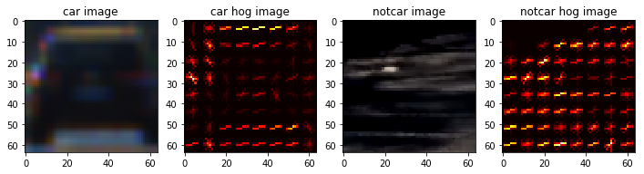
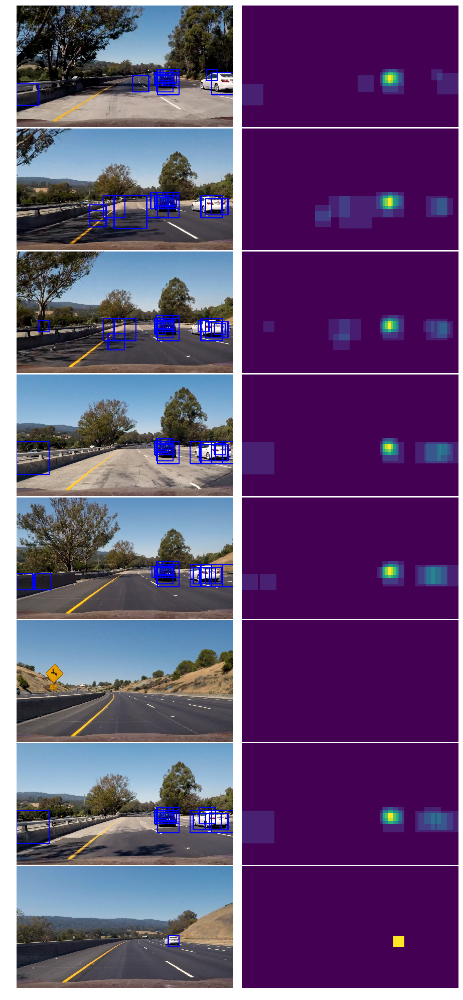
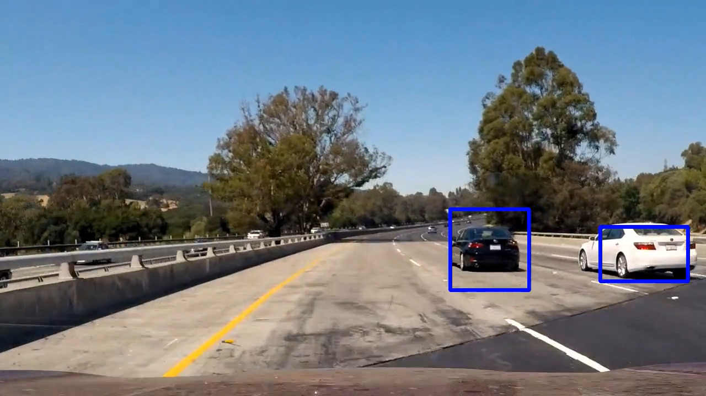

**Vehicle Detection Project**

The goals / steps of this project are the following:

* Perform a Histogram of Oriented Gradients (HOG) feature extraction on a labeled training set of images and train a classifier Linear SVM classifier
* Optionally, you can also apply a color transform and append binned color features, as well as histograms of color, to your HOG feature vector. 
* Note: for those first two steps don't forget to normalize your features and randomize a selection for training and testing.
* Implement a sliding-window technique and use your trained classifier to search for vehicles in images.
* Run your pipeline on a video stream (start with the test_video.mp4 and later implement on full project_video.mp4) and create a heat map of recurring detections frame by frame to reject outliers and follow detected vehicles.
* Estimate a bounding box for vehicles detected.

[//]: # (Image References)
[image1]: ./examples/car_not_car.png
[image2]: ./examples/HOG_example.jpg
[image3]: ./examples/sliding_windows.jpg
[image4]: ./examples/sliding_window.jpg
[image5]: ./examples/bboxes_and_heat.png
[image6]: ./examples/labels_map.png
[image7]: ./examples/output_bboxes.png
[video1]: ./project_video.mp4

## [Rubric](https://review.udacity.com/#!/rubrics/513/view) Points
### Here I will consider the rubric points individually and describe how I addressed each point in my implementation.  

---
### Writeup / README

#### 1. Provide a Writeup / README that includes all the rubric points.  

You're reading it!

### Histogram of Oriented Gradients (HOG)

#### 1. Explain how (and identify where in your code) you extracted HOG features from the training images.

The code for this step is contained in the first `get_hog_feature`s cell of the IPython notebook.  

I explored different color spaces and different `skimage.hog()` parameters (`orientations`, `pixels_per_cell`, and `cells_per_block`).  I grabbed random images from each of the two classes and displayed them to get a feel for what the `skimage.hog()` output looks like.

Here is an example using the `YCrCb` color space and HOG parameters of `orientations=8`, `pixels_per_cell=(8, 8)` and `cells_per_block=(2, 2)`:




#### 2. HOG parameters.

I tried various combinations of parameters and finally I set 
```
color_space = 'YCrCb'    # RGB, HSV, LUV, HLS YUV, YCrCb
orient = 9
pix_per_cell = 8
cell_per_block = 2
hog_channel = 'ALL'
spatial_size = (16, 16)
hist_bins = 16
```

***
__new improvement__

The color space and channel was improved from 'RGB-one channel' to 'YCrCb-all 3 channels' that makes more sensitive to get the vehicle's shape. About the spatial size and histogram I did not changed a lot, it is enough to catch these features by the initial set. The pix per cell and cell perblock is alse not changed much, I will change the scale and overlaps to catch the informations of the images.
***

#### 3. Describe how (and identify where in your code) you trained a classifier using your selected HOG features (and color features if you used them).

I trained a SVM using RandomizedSearchCV to get the best paras finally the best Kernel is Linear.

### Sliding Window Search

#### 1. How I implemented a sliding window search.  How did you decide what scales to search and how much to overlap windows?

I decided to search window positions set paras:

```
    # ystart, ystop, scale, overlap

    search_paras = [
        [400, 480, 1],
        [380, 600, 3, 1.5],
        [400, 660, 4, 2],
        [400, 660, 4, 3]]
```

***
__new improvement__

About he sliding window search, I choose 4 window sizes with different overlaps. Where the car on the top, it is more difficult to detect, for that reason I made more overlapping areas on the top, and less on the bottom.
***

#### 2. Show some examples of test images to demonstrate how your pipeline is working.  What did you do to optimize the performance of your classifier?

Ultimately I searched on 4 scales using YCrCb 3-channel HOG features plus spatially binned color and histograms of color in the feature vector, which provided a nice result.  Here are some example images:



---

### Video Implementation

#### 1. Provide a link to final video output.  The pipeline should perform reasonably well on the entire project video (somewhat wobbly or unstable bounding boxes are ok as long as you are identifying the vehicles most of the time with minimal false positives.)

Video is in folder.


#### 2. Describe how (and identify where in your code) you implemented some kind of filter for false positives and some method for combining overlapping bounding boxes.

I recorded the positions of positive detections in each frame of the video.  From the positive detections I created a heatmap and then thresholded that map to identify vehicle positions.  I then used `scipy.ndimage.measurements.label()` to identify individual blobs in the heatmap.  I then assumed each blob corresponded to a vehicle.  I constructed bounding boxes to cover the area of each blob detected.  



---

### Discussion

#### 1. Briefly discuss any problems and what could I do to make it more robust?

Here I'll talk about the approach I took, now the code works but I want to make it robust, maybe cnn is a good choice. I want to try next.

***
__new improvement__

- some consideration of problems/issues faced  
    The accuracy of svm classifier is not perfect, I can get more training data set from different database. If it can more training datas, it will get a more accury and make it to get a more accuracy to classify the type of cars and noncars.
- what could be improved about algorithm/pipeline  
    I think deep learning will works well on this project, especially a CNN will makes better than a SVM classifier. I will try them next.
***
