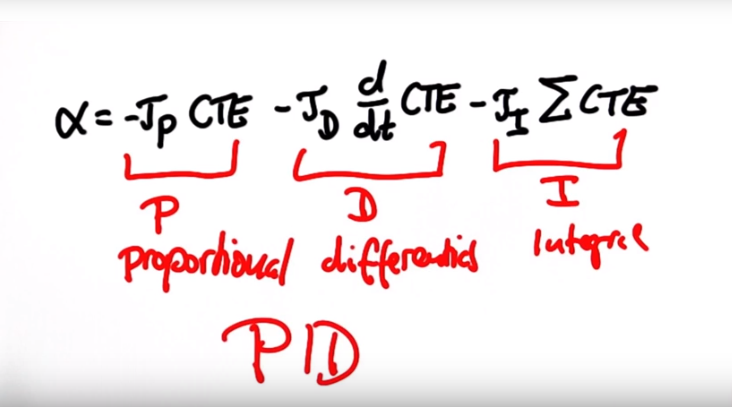

## Effect of the P, I, D

## P -> PD -> PID
- Proportional – Integral – Derivative
- 
    - P: to min CTE
    - D: to prevent oscillate
    - I: to revise system bias

## effect
- 

## how to choose the hyperparameters
- I turned the hyperparameters for serveral times.
- At first I just try again and again.
- Next I found it is useful to turn hyperparameters one by one.
- from P -> PD -> PID
- Turn P to make it back to road
- Turn D to prevent oscillate
- Turn I to make it run in the middle of the road
- Try some noises on each hyperparameters
- Finally it works