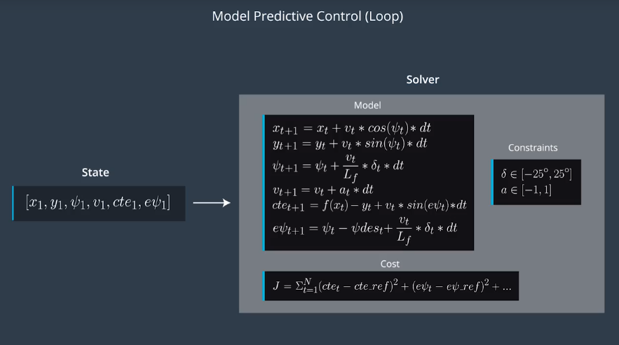

# Write Up

## Model
- states
    - x position, y position, psi orientation, velocity, cross track error, psi error 
- actuators
    - steering angle, throttle
- update equations
    - 

## N  and dt 
-  N (timestep length)
    -  N determines the number of variables optimized by the MPC. This is also the major driver of computational cost.
-  dt (elapsed duration between timesteps)
    - Larger values of dt result in less frequent actuations, which makes it harder to accurately approximate a continuous reference trajectory. 

## Waypoints
- Polynomial Fitting
    - calculate coefficients of curve based on waypoints
- Coordinate Transform
    - from global coordinates x,y to vehicle's local coordinate x,y

## 100 millisecond latency
- predict new state of the vehicle from latest state